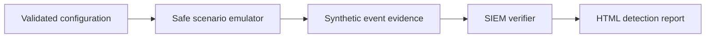

# KRONOS Detection Validation

[](https://github.com/nicolasferrerm/kronos-detection-validation/actions/workflows/ci.yml)
[](https://www.python.org/)
[](https://attack.mitre.org/)
[](LICENSE)

KRONOS is a safe-by-default purple-team portfolio lab for validating identity detections across Windows Active Directory and Microsoft Entra ID scenarios. It produces synthetic emulation evidence, builds SIEM queries, and generates an HTML detection report.

[Leer en español](README-ES.md)

## Demonstrated skills

- ATT&CK-mapped identity scenarios: AS-REP roasting, Kerberoasting, and Entra application consent.
- Read-only detection verification adapters for Microsoft Sentinel, Splunk, and Elasticsearch.
- A deterministic mock verifier for demonstrations and automated tests.
- Pydantic configuration validation, structured execution results, and Jinja2 reporting.
- Safety controls that prevent credentials alone from enabling live lab actions.

## Workflow



## Quick start

```bash
python -m venv .venv
source .venv/bin/activate
python -m pip install --upgrade pip
python -m pip install -r requirements.txt
python kronos.py --verifier mock --no-delay
```

On Windows PowerShell, activate with `.venv\Scripts\Activate.ps1`.

The default command does not contact a domain controller, Microsoft Graph, or a SIEM. Reports are written to `reports/output/` and are intentionally excluded from version control.

## Tests

```bash
python -m pip install pytest
pytest -q
```

The tests verify safe defaults, synthetic scenario output, mock detection behavior, and report generation.

## Authorized lab mode

Optional dependencies for controlled lab integrations are separated:

```bash
python -m pip install -r requirements-live.txt
```

Live actions require both `--live` and the exact confirmation phrase shown by `python kronos.py --help`. Use them only in an isolated environment you own or have written authorization to test. SIEM credentials should be supplied through a local `config.yaml`, which is ignored by Git.

## Limitations

- Mock detections prove query/report logic, not the effectiveness of a production analytic.
- Real SIEM adapters require customer-specific schemas, indexes, permissions, and time windows.
- Lab actions are alpha-stage integrations and require independent review before use.
- No credentials, real tickets, tenant identifiers, or generated reports are included.

## Author

Nicolas Ferrer — [GitHub](https://github.com/nicolasferrerm) · [ferrernicolas@proton.me](mailto:ferrernicolas@proton.me)

## License

MIT
